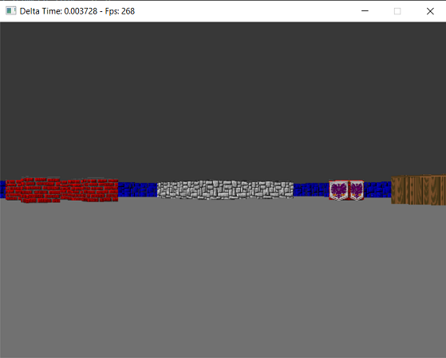
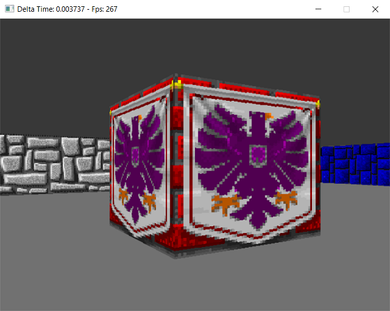
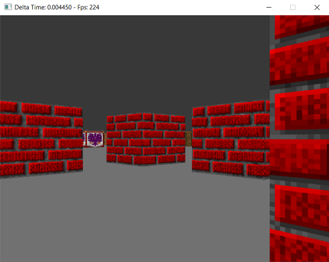

# SW Raycaster C
A software raycaster engine written in C. 

The objective is rendering our beloved Wolfenstein environment implementing raycasting tecnique on the CPU and make it run as fast as possible.

# Results
Here some screenshots to show the results:



---



---



# Usage
Just compile the project using standard CMake command:  
```cmake --build .```

or your favourite IDE with CMake support.

When running the executable control the camera with ```Arrow Keys```.


# Development
* C11 Standards
* Software managed with [CMake](https://cmake.org/)
* Window and Input management with [SDL2](https://www.libsdl.org/)
